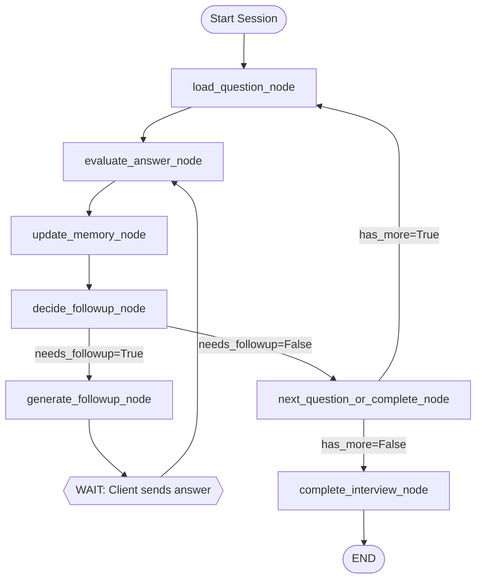

# Phase 1: Core Workflow Implementation

**Duration**: 1 week (5 days)
**Status**: Not Started
**Dependencies**: Phase 0 complete, benchmarks approved

## Objectives

Implement `InterviewConversationWorkflow` with:
- 7 workflow nodes (stateful operations)
- StateGraph with conditional routing
- Conversation memory management
- PostgreSQL checkpointing
- Comprehensive error handling

## State Schema

```python
# src/application/workflows/interview_conversation_workflow.py

from typing import TypedDict
from uuid import UUID
from langchain_core.messages import BaseMessage
from ...domain.models.answer import Answer
from ...domain.models.evaluation import Evaluation
from ...domain.models.question import Question
from ...domain.models.follow_up_question import FollowUpQuestion

class ConversationState(TypedDict):
    """State for interview conversation workflow.

    Checkpointed after each node execution to PostgreSQL.
    All UUIDs serialized as strings for JSON compatibility.
    """
    # Input (initial)
    interview_id: str  # UUID as str
    candidate_id: str  # UUID as str

    # Conversation memory (LangChain BaseMessage)
    messages: list[dict]  # Serialized BaseMessage.dict()

    # Current context
    current_question_id: str | None
    current_question: dict | None  # Question.model_dump()
    parent_question_id: str | None  # For follow-ups

    # Accumulated results
    answers: list[dict]  # Answer.model_dump()
    evaluations: list[dict]  # Evaluation.model_dump()
    followup_count: int
    cumulative_gaps: list[str]

    # Control flow
    has_more_questions: bool
    needs_followup: bool
    complete: bool

    # Error handling
    errors: list[str]
    retry_count: int

    # Checkpointing metadata
    checkpoint_thread_id: str
    last_checkpoint_time: float | None
```

## Workflow Graph Structure



## Node Implementations

### Node 1: start_session_node (Entry Point)

```python
async def start_session_node(self, state: ConversationState) -> dict:
    """Initialize conversation and load first question.

    Returns:
        State updates: current_question, messages, has_more_questions
    """
    interview_id = UUID(state["interview_id"])

    # Load interview
    interview = await self.interview_repo.get_by_id(interview_id)
    if not interview:
        return {"errors": [f"Interview {interview_id} not found"]}

    # Transition to QUESTIONING
    interview.start()
    await self.interview_repo.update(interview)

    # Get first question
    current_iq = await self.interview_repo.get_current_question(interview_id)
    if not current_iq:
        return {"errors": ["No questions in interview"]}

    question = await self.question_repo.get_by_id(current_iq.question_id)

    # Check if more questions exist
    total_questions = await self.interview_repo.count_interview_questions(interview_id)
    has_more = interview.current_question_index < total_questions - 1

    return {
        "current_question_id": str(question.id),
        "current_question": question.model_dump(mode="json"),
        "messages": [],  # Empty conversation
        "has_more_questions": has_more,
    }
```

**Tests**: `test_start_session_node_success`, `test_start_session_node_no_questions`

---

### Node 2: evaluate_answer_node

```python
async def evaluate_answer_node(self, state: ConversationState) -> dict:
    """Evaluate answer with conversation context.

    Uses LangChain adapter with conversation_history in context.
    """
    from langchain_core.messages import HumanMessage, AIMessage

    # Reconstruct domain objects
    question = Question(**state["current_question"])
    answer_text = state.get("pending_answer_text")  # From WebSocket input

    # Build context with conversation history
    conversation_history = [
        {
            "role": msg["type"],  # "ai" or "human"
            "content": msg["content"]
        }
        for msg in state.get("messages", [])
    ]

    context = {
        "interview_id": state["interview_id"],
        "candidate_id": state["candidate_id"],
        "conversation_history": conversation_history,
    }

    # Call LLM adapter (UNCHANGED API)
    evaluation_result = await self.llm.evaluate_answer(
        question=question,
        answer_text=answer_text,
        context=context
    )

    # Create Answer entity
    answer = Answer(
        interview_id=UUID(state["interview_id"]),
        question_id=UUID(state["current_question_id"]),
        text=answer_text,
        is_voice=state.get("is_voice_answer", False),
        voice_metrics=state.get("voice_metrics"),
    )
    await self.answer_repo.save(answer)

    # Create Evaluation entity
    evaluation = Evaluation(
        answer_id=answer.id,
        final_score=evaluation_result.score,
        reasoning=evaluation_result.feedback,
        strengths=evaluation_result.strengths,
        weaknesses=evaluation_result.weaknesses,
        gaps=evaluation_result.gaps,
    )
    await self.evaluation_repo.save(evaluation)

    return {
        "answers": state.get("answers", []) + [answer.model_dump(mode="json")],
        "evaluations": state.get("evaluations", []) + [evaluation.model_dump(mode="json")],
    }
```

**Tests**: `test_evaluate_answer_main_question`, `test_evaluate_answer_with_memory`

---

### Node 3: update_memory_node

```python
async def update_memory_node(self, state: ConversationState) -> dict:
    """Append Q&A to conversation memory with truncation."""
    from langchain_core.messages import HumanMessage, AIMessage

    messages = state.get("messages", [])

    # Add question (AI message)
    messages.append({
        "type": "ai",
        "content": state["current_question"]["text"],
        "additional_kwargs": {
            "question_id": state["current_question_id"],
            "question_type": state["current_question"]["question_type"]
        }
    })

    # Add answer (Human message)
    latest_answer = state["answers"][-1]
    messages.append({
        "type": "human",
        "content": latest_answer["text"],
        "additional_kwargs": {
            "answer_id": latest_answer["id"],
            "score": state["evaluations"][-1]["final_score"]
        }
    })

    # Truncate to last N messages (from Phase 0 benchmark)
    max_messages = 10  # 5 Q&A pairs
    if len(messages) > max_messages:
        messages = messages[-max_messages:]

    return {"messages": messages}
```

**Tests**: `test_update_memory_truncation`, `test_memory_size_limit`

---

### Node 4: decide_followup_node

```python
async def decide_followup_node(self, state: ConversationState) -> dict:
    """Decide if follow-up question needed.

    Break conditions (exit if ANY met):
    1. followup_count >= 3 (max reached)
    2. final_score >= 80.0 (quality sufficient)
    3. no unresolved gaps

    Returns:
        needs_followup, cumulative_gaps
    """
    followup_count = state.get("followup_count", 0)
    latest_eval = state["evaluations"][-1]

    # Break condition 1: Max follow-ups
    if followup_count >= 3:
        return {
            "needs_followup": False,
            "followup_reason": "Max follow-ups reached"
        }

    # Break condition 2: High score
    if latest_eval["final_score"] >= 80.0:
        return {
            "needs_followup": False,
            "followup_reason": "Score sufficient"
        }

    # Break condition 3: No gaps
    unresolved_gaps = [
        gap for gap in latest_eval.get("gaps", [])
        if not gap.get("resolved", False)
    ]
    if not unresolved_gaps:
        return {
            "needs_followup": False,
            "followup_reason": "No gaps detected"
        }

    # Accumulate gaps from all evaluations in this cycle
    cumulative = state.get("cumulative_gaps", [])
    for gap in unresolved_gaps:
        concept = gap.get("concept")
        if concept and concept not in cumulative:
            cumulative.append(concept)

    return {
        "needs_followup": True,
        "cumulative_gaps": cumulative,
        "followup_reason": f"Detected {len(unresolved_gaps)} gaps"
    }
```

**Tests**: `test_decide_followup_max_reached`, `test_decide_followup_high_score`, `test_decide_followup_no_gaps`, `test_decide_followup_needs`

---

### Node 5: generate_followup_node

```python
async def generate_followup_node(self, state: ConversationState) -> dict:
    """Generate follow-up question and transition state."""
    from ...domain.models.follow_up_question import FollowUpQuestion

    interview_id = UUID(state["interview_id"])
    parent_question_id = UUID(state["current_question_id"])
    followup_count = state.get("followup_count", 0)

    # Get parent question
    parent_question = Question(**state["current_question"])
    latest_answer = state["answers"][-1]

    # Determine severity from latest evaluation
    latest_eval = state["evaluations"][-1]
    severity = "moderate"  # Default
    if latest_eval.get("gaps"):
        # Find highest severity
        severity_order = {"major": 3, "moderate": 2, "minor": 1}
        unresolved = [g for g in latest_eval["gaps"] if not g.get("resolved")]
        if unresolved:
            highest = max(unresolved, key=lambda g: severity_order.get(g.get("severity", "moderate"), 0))
            severity = highest.get("severity", "moderate")

    # Generate follow-up text
    followup_text = await self.llm.generate_followup_question(
        parent_question=parent_question.text,
        answer_text=latest_answer["text"],
        missing_concepts=state["cumulative_gaps"],
        severity=severity,
        order=followup_count + 1,
        cumulative_gaps=state["cumulative_gaps"],
    )

    # Create FollowUpQuestion entity
    followup = FollowUpQuestion(
        parent_question_id=parent_question_id,
        interview_id=interview_id,
        text=followup_text,
        generated_reason=state.get("followup_reason", "Gap detected"),
        order_in_sequence=followup_count + 1,
    )
    await self.followup_repo.save(followup)

    # Update interview state (FOLLOW_UP transition)
    interview = await self.interview_repo.get_by_id(interview_id)
    interview.ask_followup(followup.id, parent_question_id)
    await self.interview_repo.update(interview)

    return {
        "current_question_id": str(followup.id),
        "current_question": {
            "id": str(followup.id),
            "text": followup.text,
            "question_type": "FOLLOW_UP",
        },
        "parent_question_id": str(parent_question_id),
        "followup_count": followup_count + 1,
        "needs_followup": False,  # Reset for next cycle
    }
```

**Tests**: `test_generate_followup_question`, `test_followup_state_transition`

---

### Node 6: next_question_or_complete_node

```python
async def next_question_or_complete_node(self, state: ConversationState) -> dict:
    """Load next question or mark for completion."""
    interview_id = UUID(state["interview_id"])

    # Check if more questions exist
    if not state.get("has_more_questions"):
        return {"complete": True}

    # Transition interview state (QUESTIONING)
    interview = await self.interview_repo.get_by_id(interview_id)
    interview.proceed_to_next_question()
    await self.interview_repo.update(interview)

    # Get next question
    current_iq = await self.interview_repo.get_current_question(interview_id)
    if not current_iq:
        return {"complete": True}  # No more questions

    question = await self.question_repo.get_by_id(current_iq.question_id)

    # Update has_more_questions
    total = await self.interview_repo.count_interview_questions(interview_id)
    has_more = interview.current_question_index < total - 1

    return {
        "current_question_id": str(question.id),
        "current_question": question.model_dump(mode="json"),
        "parent_question_id": None,  # Reset (new main question)
        "followup_count": 0,  # Reset counter
        "cumulative_gaps": [],  # Reset gaps
        "has_more_questions": has_more,
    }
```

**Tests**: `test_next_question_load`, `test_next_question_complete`

---

### Node 7: complete_interview_node

```python
async def complete_interview_node(self, state: ConversationState) -> dict:
    """Generate summary and finalize interview.

    Delegates to CompleteInterviewUseCase (REUSED from current implementation).
    """
    from ...application.use_cases.complete_interview import CompleteInterviewUseCase

    interview_id = UUID(state["interview_id"])

    # Call existing use case
    complete_uc = CompleteInterviewUseCase(
        interview_repository=self.interview_repo,
        answer_repository=self.answer_repo,
        question_repository=self.question_repo,
        follow_up_question_repository=self.followup_repo,
        evaluation_repository=self.evaluation_repo,
        llm=self.llm,
    )

    result = await complete_uc.execute(interview_id)

    return {
        "complete": True,
        "summary": result.summary.model_dump(mode="json"),
        "final_status": result.interview.status.value,
    }
```

**Tests**: `test_complete_interview_success`

---

## Conditional Edge Functions

```python
def _should_generate_followup(self, state: ConversationState) -> str:
    """Route after decide_followup_node."""
    return "generate_followup" if state["needs_followup"] else "next_or_complete"

def _should_complete(self, state: ConversationState) -> str:
    """Route after next_question_or_complete_node."""
    return "complete" if state["complete"] else "wait_for_answer"
```

## Error Handling

```python
async def _safe_node_execution(
    self,
    node_func: Callable,
    state: ConversationState,
    node_name: str
) -> dict:
    """Wrap node execution with retry logic."""
    try:
        return await node_func(state)
    except Exception as exc:
        logger.error(f"Node {node_name} failed: {exc}", exc_info=True)

        retry_count = state.get("retry_count", 0) + 1
        if retry_count >= 3:
            # Max retries - fail workflow
            return {
                "errors": state.get("errors", []) + [f"{node_name}: {str(exc)}"],
                "complete": True  # Force end
            }

        # Retry
        await asyncio.sleep(1 * retry_count)  # Backoff
        return {
            "retry_count": retry_count,
            "errors": state.get("errors", []) + [f"{node_name} retry {retry_count}"]
        }
```

## Tasks

### Task 1.1: Create ConversationState TypedDict (2h)

- Define all state fields with type hints
- Add docstring explaining serialization strategy
- Validate with mypy

### Task 1.2: Implement 7 Workflow Nodes (16h)

- Node 1: start_session_node (2h)
- Node 2: evaluate_answer_node (3h)
- Node 3: update_memory_node (2h)
- Node 4: decide_followup_node (3h)
- Node 5: generate_followup_node (3h)
- Node 6: next_question_or_complete_node (2h)
- Node 7: complete_interview_node (1h)

### Task 1.3: Build StateGraph (4h)

- Create graph structure
- Add conditional edges
- Integrate checkpointing
- Test graph compilation

### Task 1.4: Add Error Handling (4h)

- Implement retry wrapper
- Add error state tracking
- Test error recovery paths

### Task 1.5: Write Unit Tests (8h)

- 1 test file per node (7 files)
- Edge case coverage
- Error scenario tests

### Task 1.6: Integration Testing (4h)

- Full workflow execution test
- Checkpoint persistence test
- Memory management test

## Success Criteria

**Functionality**:
- [ ] All 7 nodes execute without errors
- [ ] StateGraph compiles successfully
- [ ] Conditional routing works correctly
- [ ] Checkpointing persists state after each node

**Testing**:
- [ ] >90% code coverage for workflow nodes
- [ ] All unit tests pass (7 test files)
- [ ] Integration test passes (full workflow)

**Code Quality**:
- [ ] Mypy type checking passes
- [ ] No circular dependencies
- [ ] Docstrings for all nodes

## Deliverables

- [ ] `src/application/workflows/interview_conversation_workflow.py` (~500 LOC)
- [ ] Unit tests in `tests/unit/application/workflows/` (7 files)
- [ ] Integration test in `tests/integration/workflows/`
- [ ] Workflow diagram (Mermaid) in plan.md

## Risks

**Risk**: Node complexity exceeds estimates
- **Mitigation**: Break nodes into smaller helper methods

**Risk**: State schema changes during implementation
- **Mitigation**: Version state schema, support backward compat

## Unresolved Questions

1. Should memory truncation happen before or after evaluate_answer_node?
2. Error recovery: retry individual nodes or entire workflow?
3. Checkpoint retention: keep all checkpoints or only latest?

---

**Phase 1 Status**: Ready to start after Phase 0 approval
**Next Phase**: Phase 2 (Integration & Testing)
